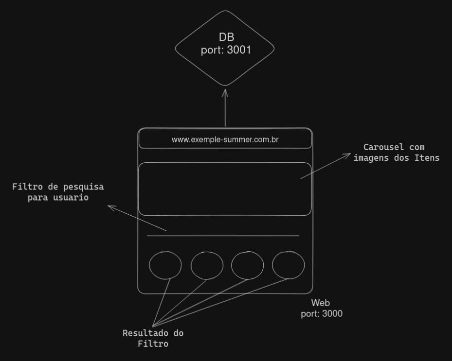

<br />

## Resumo

Olá! Esse teste consistia basicamente em criar uma página web (porta: 3000) que se comunique com uma API (porta: 3001), e assim consumir os dados para gerar uma página para que os usuários possam consultar e adquirir os produtos.

## Deploy
Se você quiser ver a aplicação rodando efetivamene, eu fiz o deploy no render: https://summer-front.onrender.com/

### Como fiz o deploy: 
Para fazer o deploy foi necessário fazer upload das imagens dos contâiners(front e back) e em seguida transferir as imagens para o render
Para que não houvesse problemas com cors, váriáveis de desenvolvimento foram utilizadas. 


## Instruções para que o teste fosse feito: 
No diretório Frontend ja existe pronto um `Dockerfile` para configurar a imagem e há um `Docker Compose` a criação da aplicação.

Houve também uma ideia de layout



## Stacks:

### Requisitos para o teste:

- JavaScript com o uso de ReactJs
- Conhecimento basico de NodeJs
- Docker
- Ciclo de vida
- Git

### Desejável:

- PHP
- CSS
- Frameworks de CSS:
  - Bootstrap
  - Tailwind
- GitHub workflow
- Kanban

<hr />

### Iniciando o Projeto

1. Clone o projeto:

```
git clone git@github.com:Summer-Developer-Team/Test-Dev-Jr.git
```

2. Entre no diretório e instale as dependências:

```
cd Test-Dev-Jr && npm install
```

3. Suba a Aaplicação

```
npm run compose ou docker-compose up
```

<hr />

### EndPoints:

### Get All Products

```
product/
```

### Get Products by ID

```
product/id
```

### Get Products by Name

```
product/search?q=<str_to_search>
```
